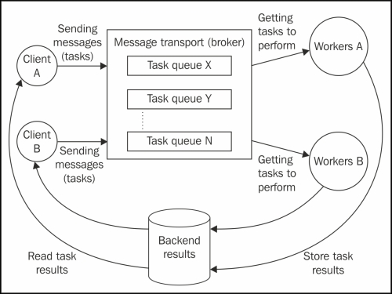
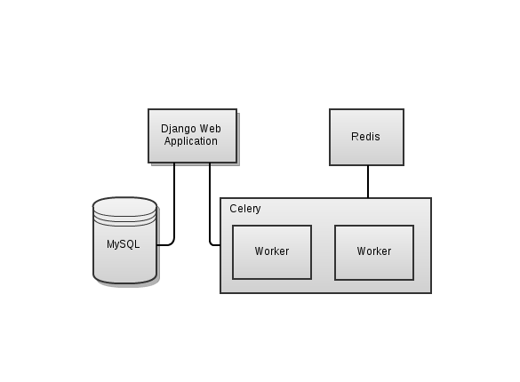
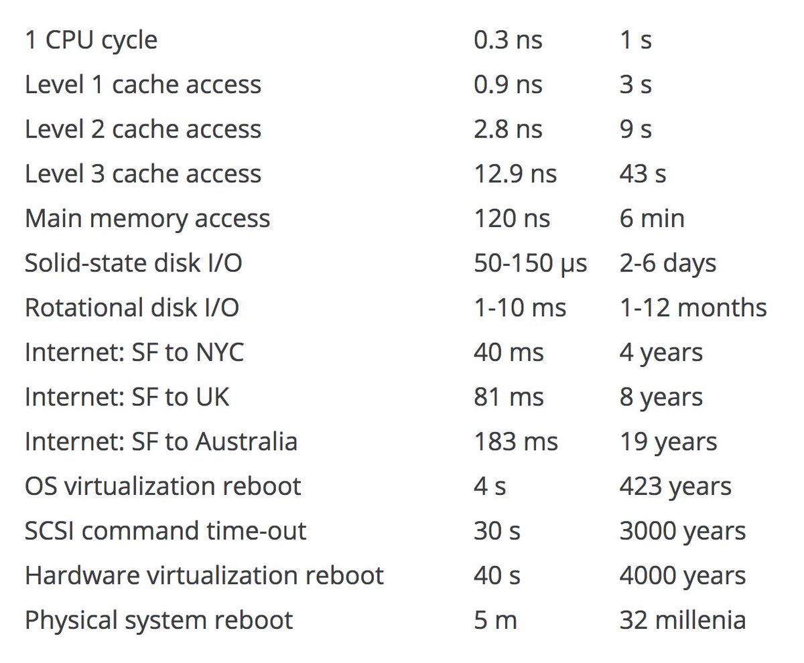
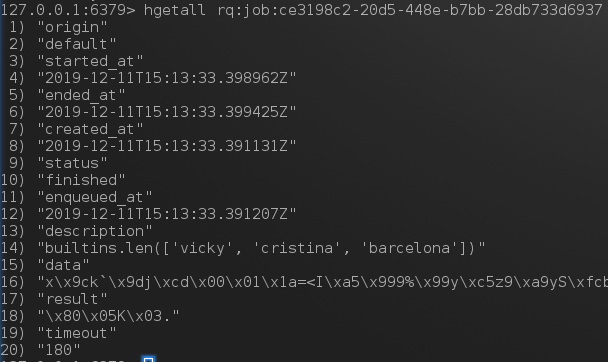

<style>
   p, li {
       font-size: 22pt;
   }
   h1 {
       font-size: 24pt;
   }
   h2 {
       font-size: 22pt;
   }
   h3 {
       font-size: 18pt;
   }
   h6 {
       font-size: 12pt;
   }
</style>


# <!--fit--> django, rq, и стыдливая параллельность

---

# Кто я такой

* Пример, меня зовут Игорь
* Занимаюсь машинным обучением в Ламода
* У меня суровый академический бэкграунд
* У меня есть пет проджекты, я их пишу на питоне
* Мои коллеги дата сайнтисты тоже пишут на питоне
* В ближайшие полтора часа я конечно буду много лукавить

---

# Про что я хочу поговорить

* Почему и когда лучше взять очереди задач
* Какие очереди задач бывают, плюсы-минусы, личные опыт
* Почему вам скорее всего не нужен **celery**
* Как и зачем убеждать коллег-питонистов использовать очереди

---

# Какие параллельные возможности есть "в дикой природе"?

* Много данных, мало вычислений &mdash; NoSQL, go
* Много данных, довольно много вычислений &mdash; spark, scala
* Другое: tensorflow, pytorch, cuda, intelmpi, openmp, etc

---

# Закон Амдала: максимальное ускорение ограничено

$$ S_p = \frac{1}{\alpha + \frac{1 - \alpha}{p}} $$

$\alpha$ &mdash; часть задачи, которая может быть только последовательной
$(1 - \alpha)$ часть, которую можно распараллелить _идеально_
$S_p$ &mdash; максимальное возможное ускорение задачи
$p$ &mdash; число процессоров

---

# Очереди задач (Task queues)

* Очереди задач это системы, которые определяют:
  * очереди
  * задачи (сообщения в очереди с "единицей рабочего кусочка")
  * (часто, не всегда) последовательность выполнения задач
  * мониторинг статусов задач
* Основные компоненты:
  * брокер
  * воркеры
  * "заказчики"
* У каждого воркера свой GIL

---

# Питон и очереди задач &mdash; хорошая идея

* Но в python есть GIL
    * для CPU-heavy задач треды не работают
    * GIL обеспечивает что в одном процессе один тред всегда
* В системах очередей задач каждый воркер запускает свой процесс
* Консистентность на уровне "блоки задачи"
* Все ждут что будет в 3.9+

---

# Очередь задач: картинка

<br>
<br>
<br>
<br>
<br>
<br>
<br>
<br>
<br>



---

# Пример использования очереди в проекте

<br>
<br>
<br>
<br>
<br>
<br>
<br>
<br>




---

# Почему питон и очереди это хорошо и для каких это задач?

* Вы можете хотеть обработать задачу нелокально: другие ресурсы, другое железо, другие данные
* Параллельность на уровне процессов
* Приобретаем ~асинхронность и масштабируемость

При этом мы теряем время на подготовку задачи для очереди и посылку её в брокер по сети

...в брокер по сети 🤔 🤔 🤔

...по сети 🤔 🤔 🤔

---

# А что если без сети?


<br>
<br>
<br>
<br>
<br>
<br>
<br>
<br>
<br>



---

# Полезное правило оптимизации

Бесполезно давать человеку ещё один компьютер для вычислений если этот человек ещё не научился использовать уже тот что есть.

---

# Какие задачи принято решать очередями?

* Отправить письмо после регистрации пользователя на сайте
* Генерация отчета по данным
* Любая долгая задача, не влезающая в request timeout
* $\forall$ "Embarassingly parallel" задача

---

# Минусы очередей задач

Основных минуса у подобных систем только два:

* Подготовка и постановка задачи для брокера занимает время 
* Подготовка и постановка задачи в очередь занимает ресурсы
* Нужно следить за состоянием задачи

Свою очередь можно написать за ~100 строк. Особенно на питоне

Не стоит этого делать.

---

# Celery: стандартная очередь задач в python

* Оптимизирована для мелких задач
* Очень сложно настроить для более-менее универсального применения
* Если угореть, можно сделать круто:
    * Много поддерживаемых брокеров
    * Последовательные задачи друг за другом или сложнее
    * Условное выполнение задач
    * Тонны конфигурационных опций

С нулевого уровня осознанная компетенция для готовой задачи достигается за несколько недель.

---

```python
# tasks.py
from celery import Celery

app = Celery(
    'example-tasks',
    broker="redis://localhost",  
    backend="redis://localhost"
)

@app.task
def mul(x, y):
    return x * y


@app.task
def safediv(x, y):
    return x / y if y != 0 else 0
```

---

# Использование определённых задач

```python
from tasks import mul, safediv

def main():
    result = mul.delay(25, 17)
    print(result.status)  # PENDING
    print(result.get())   # 425
    print(result.status)  # SUCCESS
```

```bash
celery worker --app tasks --loglevel INFO
```

---

# Цепочка задач

```python
from celery import chain
from tasks import mul, safediv

def main():
    ch = chain(mul.s(20, 17), safediv.s(3))
    print(ch)            # tasks.add(20, 17) | tasks.safediv(3)
    result = ch()
    print(result.state)  # PENDING
    print(result.get())  # 113.33333333333333
    print(result.state)  # SUCCESS
```

Всё что сложнее &mdash; делается сложно и лучше работает с amqp

---

# Enter rq

* RQ &mdash; redis queue <http://python-rq.org/>
* На той же машине запустить редис это одна команда
    * `docker run -p 6379:6379 -d redis`
* Ставится просто `pip install rq`
* Есть дашборд `pip install rq-dasboard`

Сильно проще из-за одного явного бэкенда

Отличный способ приучить коллег вылезать из jupyter notebook 😈

---

```python
import time

from rq import Queue
from redis import Redis

q = Queue(connection=Redis())

job = q.enqueue(len, ['vicky', 'cristina', 'barcelona'])

while job.result is None:
    time.sleep(1)

print(job.result) 
```

```bash
rq worker  # тот же PYTHONPATH
```

---

<br>
<br>
<br>
<br>
<br>
<br>
<br>
<br>
<br>



---

# DEMO

давайте запилим rq в сервис на джанге

---

# Advertise like shameles whores

Если что, пишите:

* twitter/telegram @shripmsizemoose
* fb.me/imosyagin
* :email: igor@mosyag.in
* :link: https://newpodcast2.live